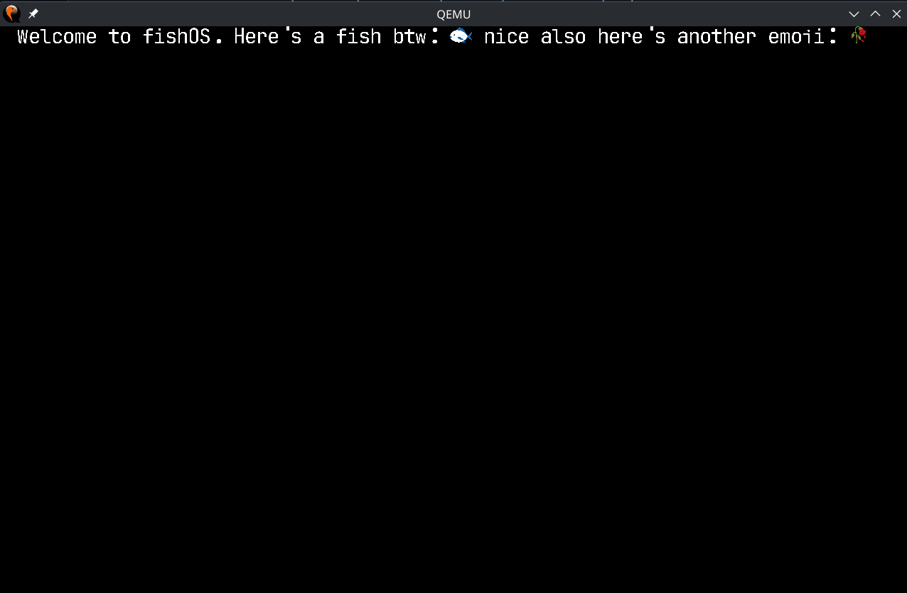

# 🐟 FishOS 0.0.14

# What's this?
It's an os built from scratch, the only thing not built by me here is grub that i'm only using to boot.

# Why?
Why not?

# Current state at boot


# Where iso???
```fishos.iso``` is in the repo and is rebuilt when you run ```fish compile.fish```.

# How to use
If you're on linux you can just install with your package manager the fish shell then you can run ```fish compile.fish```. If you're on windows god help you.

# I wanna run on an actual computer not qemu
Well then you're in luck the ```fishos.iso``` works on any 64bit x86 machine.

# Arm support?
Soon.

# How to install fish shell to do ```fish compile.fish```
Debian/ubuntu/other distros that use ```apt```
```fish
sudo apt update && sudo apt install fish
```

Arch/Manjaro/other distros that use ```pacman```
```fish
sudo pacman -Syu fish
```

Fedora/RHEL/other distros that use ```dnf```
```fish
sudo dnf install fish
```

openSUSE (```zypper```)
```fish
sudo zypper install fish
```

Alpine (```apk```)
```fish
sudo apk add fish
```

# Known bugs (will be fixed ASAP)
- Printing multiple rows of text breaks stuff
- Some emojis cause kernel panic
- Printing too much text in a single print calls breaks stuff
- Memory allocator doesn't handle well allocs >256mb

# Version history
Notes: It works that's it. For now it boots and does something interesting, it's only gonna become an actual useful os over time.
- 0.0.14 — Readme fix again (again).
- 0.0.13 — Readme fix again.
- 0.0.12 — Readme fix.
- 0.0.11 — Emoji rendering is fixed, font rendering is fixed (FINALLLLYYYYY), just don't breathe near it wrong or it WILL kernel panic.
- 0.0.10 — Readme fix. 
- 0.0.9 — Major upgrade to print system, now supports all utf8 + emojis, emojis rendering is very temporarily broken because of a missing svg command, font is more accurate now, still size and position problems but way better than before. Also fixed a major bug in the slab part of the memory allocator :) For now at boot just spams "Welcome to fishOS!".
- 0.0.8 — Major upgrade to compile.fish now auto dependency installing + os now boots on uefi systems + better screen res detection + better readme.
- 0.0.7 — Slightly better compile.fish.
- 0.0.6 — Faster memory allocator and char caching for faster than ever print(). Also the test displayed on screen changed: we print() all of the available chars in one call as a single string in a loop instead of each char one after the other in a loop this is more representative of print() performance and char caching effectiveness.
- 0.0.5 — Print function scrollback is fixed, way better fill algorithm for chars.
- 0.0.4 — PRINT FUNCTION WORKS + MEMORY ALLOCATOR FIXED + FINALLY
- 0.0.3 — Better text fill even though still flawed.
- 0.0.2 — Readme edit.
- 0.0.1 — memory allocator + frame render + text raster + bouncing text
- junk — old stuff

# What's each file for?
- fishOS.c -> the os.
- compile.fish -> fish script to build + run in qemu the os.
- fishos.iso -> ready to go iso.
- boot.asm -> 32 bit mode -> 64 mode + satisfy useless requirements like gdt.
- linker.ld -> Puts stuff where it I want it to in memory.
- boot/grub/grub.cfg -> tells grub to give the os a framebuffer of the right size and a memory map.
- OVMF_CODE.4m.fd -> a file so qemu can do uefi.
- ovmf_vars.fd -> another file so qemu can do uefi.
- README.md -> what you're reading rn.
- readme_image_1.png -> Current state at boot section image.
- LICENSE -> the license.

# License
MIT license: <a href="./LICENSE">LICENSE</a>